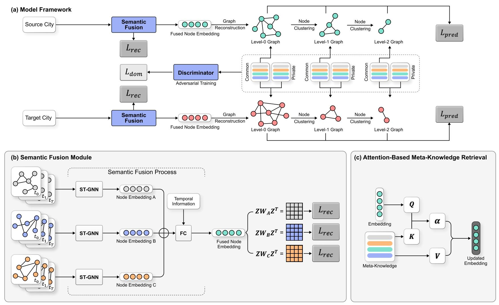

# SFMGTL
This is the repository for the paper named ''Semantic-Fused Multi-Granularity Cross-City Traffic Prediction'' published in **Transportation Research Part C**. In this paper, we propose a Semantic-Fused Multi-Granularity Transfer Learning (SFMGTL) model to achieve knowledge transfer across cities with fused semantics at different granularities. In detail, we design a semantic fusion module to fuse various semantics while conserving static spatial dependencies via reconstruction losses. Then, a fused graph is constructed based on node features through graph structure learning. Afterwards, we implement hierarchical node clustering to generate graphs with different granularity. To extract feasible meta-knowledge, we further introduce common and private memories and obtain domain-invariant features via adversarial training. \review{It is worth noting that our work jointly addresses semantic fusion and multi-granularity issues in transfer learning. We conduct extensive experiments on six real-world datasets to verify the effectiveness of our SFMGTL model by comparing it with other state-of-the-art baselines. 



## Model Training and Testing

The dataset can be acquired in the *data/dataset.zip*, just upzip it for using. Both training and testing functions are in *main.py* file, and you can directly run it by:

```shell
python main.py --scity 'NY' --tcity 'DC' --datatype 'pickup' --batch_size 64 --seed 12 --train_days 7 --hidden_dim 32
```


### Cite the paper as follows:

    @

